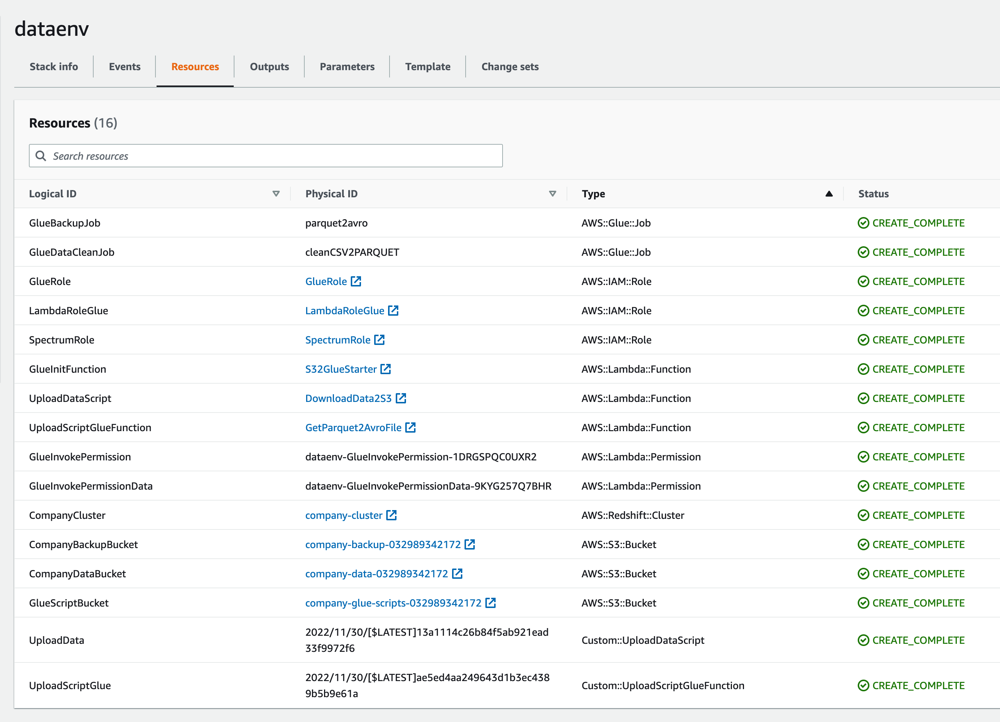

# DATA API REST

_All the credentials, aws resources and others were created on a temporal aws account env so the name of some resources could change. This env could be not available in the time that you are reading that. This repo is only an example and a lab, to use please consider better security practices on security and aws configurations._

<h1>Content table</h1>

- [DATA API REST](#data-api-rest)
  - [Repository structure](#repository-structure)
  - [Install API](#install-api)
  - [Credentials and table configuration](#credentials-and-table-configuration)
  - [Use API](#use-api)
  - [Architecture description](#architecture-description)
  - [Challenge explanation](#challenge-explanation)
    - [Challenge 1](#challenge-1)
      - [1. The historic upload could be done in two ways](#1-the-historic-upload-could-be-done-in-two-ways)
      - [2. The API REST is developed with Python, Fast API.](#2-the-api-rest-is-developed-with-python-fast-api)
        - [1. The validation](#1-the-validation)
        - [2. Row qty verification:](#2-row-qty-verification)
        - [3. multitable](#3-multitable)
      - [3. Backup](#3-backup)
      - [4. Restore](#4-restore)
    - [Challenge 2](#challenge-2)
    - [1. HIRES\_DEPARTMENT\_JOB](#1-hires_department_job)
    - [2. DEPARTMENTS\_HIRED\_ABOVE\_MEAN](#2-departments_hired_above_mean)
  - [AWS preparation](#aws-preparation)
    - [1. Cloudformation](#1-cloudformation)
    - [2. Redshift](#2-redshift)
    - [Running api on EC2](#running-api-on-ec2)


## Repository structure

```bash
.
├── Dockerfile                      -- Dockerfile
├── README.md                       -- Readme file
├── app                              -- App folder
│   ├── __init__.py                                 
│   ├── database
│   │   └── users.py                -- Users 'Database' basic auth
│   ├── main.py                     -- main api script
│   ├── parameters.py               -- Parameter objects to use requests
│   ├── security
│   │   └── auth.py                 -- scripts basic auth
│   ├── services    
│   │   └── redshift.py             -- Redshift service to run queries
│   ├── templates      
│   │   └── data_dict.py            -- Data dictionary definition
│   └── validations
│       └── tables.py               -- scripts validation
├── aws
│   ├── cloudformation
│   │   └── template.yml            -- CloudFormation template file
│   ├── glue
│   │   └── parquet2avro.py         -- Glue script parquet 2 avro backup
│   └── lambda
│       └── triggerGluefromS3.py    -- Lambda script to trigger Glue parquet2 avro
├── data                            -- Provided data
│   ├── departments.csv
│   ├── hired_employees.csv
│   └── jobs.csv
├── images                          -- images readme
├── requirements.txt                -- python requirements 
├── scripts
│   ├── ec2-preparation.sh          -- ec2 config bash
│   └── post_file.sh                -- example of file upload to api
└── sql                             -- SQL Queries

```


## Install API

If necessary please configure first according to the sections [Credentials and table configuration](#credentials-and-table-configuration) and [AWS preparation](#aws-preparation). If you don't have the necessity to use the api as this project ad hoc you can configure and modify the services to add and modify you database engine.

To install and use the api.

Build the container, providing a tag:  
`docker build -t data_api:0.1 .`

Then you can run the container, passing in a name for the container, and the previously used tag:  
`docker run -p 8000:8000 --name my-api data_api:0.1`

The API will be available in or in the machine host used
[http://127.0.0.1:8000/](http://127.0.0.1:8000/)

Note that if you used the code as-is with the `--reload` option that you won't be able to kill the container using `CTRL + C`.  
Instead in another terminal window you can kill the container using Docker's kill command:  
`docker kill my-api`

## Credentials and table configuration

In order to configure credentials and tables is you should.

1. Run the [table creation query](./sql/table_creation.sql)
2. Configure credentials in creds dict in [redshift service file ](./app/services/redshift.py)
3. For the backup, restore and insights use you will need to run the following queries, modifying the bucket and role name.
   - [Backup](./sql/backup_procedure.sql)
   - [Restore](./sql/restore_procedure.sql)
   - [Insight](./sql/insights.sql)
## Use API

## Architecture description

## Challenge explanation

To resolve the challenge was used this stack
- **API REST:** Fast Api a popular python framework used in api creation.
- **DATABASE:** the database used is AWS Redshift Warehouse service, according to the challenge these need to support big data, so for me these is appropriate in order to take advantage of their scalability, flexibility and compatibility.
- **DATAUPLOAD AND TRANFORMATION:** Directly using the redshift option for import data and cleaning using SQL and AWS Glue to  transform parquet backup in AVRO Format
- **File System (Also a kind of data lake):** AWS S3
- **ENDPOINTS:** The API REST is developed with Python, Fast API which have 5 endpoints to use 
  1. upload/ to upload the data Challenge 1 2.
  2. backup/ to backup the data Challenge 1 3.
  3. restore/ to restore the data Challenge 1 4.
  4. insights/ to show insights Challenge 2
  5. / a little greeting
- **AUTH:** The API have a basic authentication which use a fake database of users to ask for credential for use the services that affect the database like the first 3 endpoints listed previously 
- **Docker:** There is possible to install and use the package containerized using Docker the explanation is on the section of this very README [Install API section](#install-api)
### Challenge 1
#### 1. The historic upload could be done in two ways
   - In the [upload data queries](./sql/copy_data.sql) we can copy directly from S3 CSV to Redshift and cleaning it using SQL, these upload is very scalable and support massive loads in short time periods (depending on cluster resources)
   - Using spark script on Glue to ETL cleaning the data and updating to redshift
#### 2. The API REST is developed with Python, Fast API.
##### 1. The validation
 Is done with the [data_dict file](app/templates/data_dict.py) generating dynamically filters [validations.tables](app/validations/tables.py) from and separates the correct data from the incorrect. The filters applicated are:
    - For integer data there is a regular expression that filter the data which is not completely an integer type.
    ```python
    df['{c}'].str.contains('^[0-9]*$')
    ```
    - For datetime iso format the verification was made using which verify if the date is valid.
    ```python
    pd.to_datetime(df['{c}'], errors='coerce',format='%Y-%m-%dT%H:%M:%SZ')
    ```
    - In all the columns is applied the null filter to select these like erroneous data.
    ```python
    df['{c}'].notnull()
    ```
    these script is executed with exec and the dataframe is separated according to the validation, one is uploaded and the other is logged in json format
    ```python
    codeline = generate_filter_codes(df, ttype)
    loc = {'df': df}
    exec(codeline, globals(), loc)

    df_ok = loc['df_ok']
    df_failed = loc['df_failed']
    upload_df_redshift(df_ok, ttype)
    content_response['rows_failed'] =  df_failed.fillna('').to_dict(orient="records")
    ```
    

##### 2. Row qty verification:
On the [upload definition](app/main.py) function there is a verification for minimum and maximum number of lines.:
   ```python
    if nrows < 1 or nrows > 1000:
    return JSONResponse(status_code=405,
                        content={'error': 'The number of lines should be between 1 and 1000'})
   ```
##### 3. multitable
the upload/ endpoint recognize the type of table uploaded.

   
#### 3. Backup
The endpoint backup/ calls a stored procedure [backup procedure query](sql/backup_procedures.sql), the query save the table in parquet format and for business requirements these trigger a lambda which trigger a Glue job that transform these parquet into AVRO. Detailed explanation in [AWS preparation](#aws-preparation) section
```plpsql
    CREATE OR REPLACE PROCEDURE BACKUP_{table}()
        AS $$
        BEGIN
        UNLOAD('SELECT * FROM COMPANY.PUBLIC.{table}')
        to 's3://company-backup-{account_id}/backup-parquet/{table}'
        iam_role 'arn:aws:iam::{account_id}:role/SpectrumRole'
        FORMAT PARQUET ALLOWOVERWRITE;
        END;
        $$
        LANGUAGE plpgsql
        ;
```
#### 4. Restore
The endpoint restore/ calls a stored procedure [restore procedure query](sql/restore_procedures.sql), that delete, restore copying the avro file and commit the transaction.

   ```plpsql
    CREATE OR REPLACE PROCEDURE RESTORE_{table}()
        AS $$
        BEGIN
        DELETE FROM {table};
        COPY {table} FROM 
        's3://company-backup-{account_id}/backup/{table}.avro'
        iam_role 'arn:aws:iam::{account_id}:role/SpectrumRole'
        AVRO AS 'auto' IGNOREALLERRORS;
        END;
        $$
        LANGUAGE plpgsql
        ;
```
### Challenge 2
### 1. HIRES_DEPARTMENT_JOB
```plpsql

CREATE OR REPLACE VIEW HIRES_DEPARTMENT_JOB AS
WITH BY_QTR AS (SELECT DEPARTMENT,
                       JOB,
                       EXTRACT(QTR FROM TO_DATE("DATETIME", 'YYYY-MM-DD"T"HH24:MI:SSZ')) AS QTR,
                       COUNT(*)                                                          AS N_EMPLOYEES
                FROM HIRED_EMPLOYEES E
                         LEFT JOIN JOBS J ON E.JOB_ID = J.ID
                         LEFT JOIN DEPARTMENTS D ON E.DEPARTMENT_ID = D.ID
                WHERE EXTRACT(Y FROM TO_DATE("DATETIME", 'YYYY-MM-DD"T"HH24:MI:SSZ')) = 2021
                GROUP BY DEPARTMENT, JOB, QTR)
SELECT DEPARTMENT,
       JOB,
       SUM(CASE WHEN QTR = 1 THEN N_EMPLOYEES ELSE 0 END) AS Q1,
       SUM(CASE WHEN QTR = 2 THEN N_EMPLOYEES ELSE 0 END) AS Q2,
       SUM(CASE WHEN QTR = 3 THEN N_EMPLOYEES ELSE 0 END) AS Q3,
       SUM(CASE WHEN QTR = 4 THEN N_EMPLOYEES ELSE 0 END) AS Q4
FROM BY_QTR
GROUP BY DEPARTMENT,JOB
ORDER BY DEPARTMENT,JOB;
```
### 2. DEPARTMENTS_HIRED_ABOVE_MEAN
```plpsql
CREATE OR REPLACE VIEW DEPARTMENTS_HIRED_ABOVE_MEAN AS
WITH HIRES_BY_DEPARTMENT AS (SELECT D.ID, DEPARTMENT, COUNT(*) HIRED
                             FROM HIRED_EMPLOYEES E
                                      LEFT JOIN DEPARTMENTS D ON E.DEPARTMENT_ID = D.ID
                             WHERE EXTRACT(Y FROM TO_DATE("DATETIME", 'YYYY-MM-DD"T"HH24:MI:SSZ')) = 2021
                             GROUP BY 1, 2)
SELECT ID, DEPARTMENT, HIRED
FROM HIRES_BY_DEPARTMENT
WHERE HIRED > (SELECT AVG(HIRED) FROM HIRES_BY_DEPARTMENT)
ORDER BY 3 DESC;

```
## AWS preparation

### 1. Cloudformation ### 
Upload the [aws/cloudformation/template.yml](aws/cloudformation/template.yml) to cloudformation  and wait until all resources are created
   


This will create these resources 
- The Glue Job to trigger Glue from lambda
- The Roles for Glue, Lambda and Redshift for use S3 and Glue
- Lambda function that init the Glue scripts when the parquet file have been written.
- Lambda Function that download the data to the company data bucket
- The Redshift Cluster, with the credentials used for redshift database and user.
- Three buckets for Company data, Company backup and Glue Script the name is the join of the type of content that are going to have and the id of the account. (to be unique)
- A custom resource that run the lambda for download data

### 2. Redshift

 Connect to the redshift cluster using your preferred IDE or directly on redshift console in the Query editor section the credentials are the same of the template credentials, run [sql/full.sql](sql/full.sql) queries changing the {account_id} for the id of the account used in the redshift cluster if you have changed the database name in the template ofr cloudformation you will need to change these names on the queries


### Running api on EC2
 Is possible to upload and run the api from a EC2 just 


<h2> About me </h2>
 

You can find me on [![LinkedIn][1.1]][1] or on [![Kaggle][2.1]][2].

My gitlab :see_no_evil: [![LinkedIn][3.1]][3] 

<!-- Icons -->

[1.1]: https://img.shields.io/badge/LinkedIn-0077B5?style=plastic&logo=linkedin&logoColor=white

[1]: https://www.linkedin.com/in/raul-camilo-martin-bernal/

[2.1]: https://img.shields.io/badge/Kaggle-20BEFF?style=plastic&logo=kaggle&logoColor=white

[2]: https://www.kaggle.com/rmartin1526

[3.1]: https://img.shields.io/badge/GitLab-FCA121?style=plastic&logo=gitlab&logoColor=white

[3]: https://gitlab.com/rcamilo1526